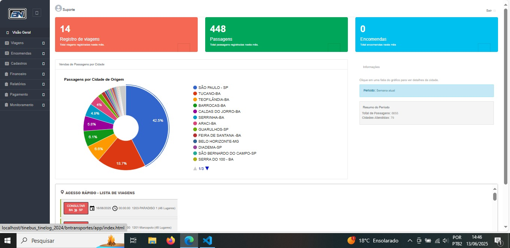

# Painel de Vendas por Cidade - BN Transportes

Este projeto é um painel administrativo para monitoramento de vendas de passagens, viagens e encomendas, com destaque para o **gráfico de vendas por cidade de origem**. O sistema foi desenvolvido em PHP, MySQL e JavaScript, utilizando Google Charts para visualização dos dados.

## Screenshot do Projeto


!Tela Atualizada (https://github.com/robertosilva19/Painel-de-Vendas-por-Cidade/blob/b1495a8a56a9ec6edca591b29da70c769beb9f89/tela%20atualizada.jpeg)

## Funcionalidades

- **Dashboard** com estatísticas de viagens, passagens e encomendas do mês.
- **Gráfico dinâmico** de vendas de passagens por cidade de origem.
- **Resumo do período** com total de passagens e cidades atendidas.
- **Mensagens amigáveis** quando não há dados para o período.
- **Integração backend/frontend** via endpoint PHP e consumo por JavaScript.
- **Layout responsivo** e integração com Bootstrap.

## Processo de Criação

### 1. Levantamento de Requisitos

- Necessidade de visualizar rapidamente as cidades com maior volume de vendas de passagens.
- Possibilidade de filtrar por período (posteriormente removido para simplificação).
- Integração com dados já existentes no banco de dados da empresa.

### 2. Modelagem e Ajustes no Banco de Dados

- Análise das tabelas `passageiros` e `bus_viagens` para identificar os campos necessários.
- Ajuste do SQL para agrupar os dados por cidade de origem (`bus_ponto_inicial`).
- Criação de queries otimizadas para sumarizar os dados de vendas.

### 3. Backend (PHP)

- Criação de endpoint PHP (`vendas-cidades.php`) para fornecer os dados agregados ao frontend.
- Implementação de método na classe responsável para buscar e agrupar os dados conforme o novo SQL.
- Padronização dos nomes dos campos retornados para facilitar o consumo no frontend.

### 4. Frontend (HTML/JS)

- Integração do Google Charts para exibição do gráfico de pizza.
- Desenvolvimento de funções JavaScript para consumir o endpoint, processar os dados e alimentar o gráfico.
- Implementação de painel de resumo do período e mensagens amigáveis para ausência de dados.
- Ajuste do layout para melhor experiência do usuário.

### 5. Filtros e Ajustes

- Inicialmente implementado filtro por data, permitindo ao usuário selecionar um período.
- Após revisão de requisitos, o filtro de datas foi removido/comentado para simplificar a visualização.
- Refatoração do código para garantir compatibilidade entre backend e frontend.

### 6. Testes e Validação

- Testes de integração entre backend e frontend.
- Validação dos dados apresentados no gráfico.
- Ajustes de layout e responsividade.

## Como Executar

1. Clone este repositório:
    ```bash
    git clone https://github.com/seu-usuario/seu-repositorio.git
    ```
2. Configure o acesso ao banco de dados em `config.php`.
3. Importe as tabelas necessárias (`passageiros`, `bus_viagens`, etc.) no seu MySQL.
4. Acesse o painel pelo navegador e visualize o dashboard.

## Tecnologias Utilizadas

- PHP 7+
- MySQL/MariaDB
- JavaScript (ES6+)
- Google Charts
- Bootstrap 3/4

## Observações

- O filtro de datas está comentado no código, podendo ser reativado conforme necessidade futura.
- O projeto pode ser expandido para incluir outros tipos de gráficos e relatórios.

## Contribuição

Pull requests são bem-vindos! Para mudanças maiores, abra uma issue primeiro para discutir o que você gostaria de modificar.

---

**Desenvolvido por Roberto Silva.**
